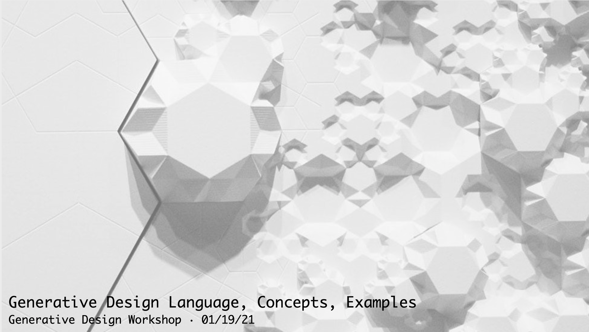

# Week 01 · Course Overview

### Slides

[*Generative Design Language, Concepts, Examples*](GenerativeDesign-s21-intro-deck.pdf)

##### Referenced Works from the Deck

- [Joris Laarman](https://www.jorislaarman.com) · [Bone Chair](https://www.jorislaarman.com/work/bone-chair/)
- [Charles Minard](https://en.wikipedia.org/wiki/Charles_Joseph_Minard) · [Collected Works](https://www.nationalgeographic.com/news/2017/03/charles-minard-cartography-infographics-history/)
- [W.E.B. Du Bois](https://en.wikipedia.org/wiki/W._E._B._Du_Bois) · [The Georgia Negro](https://medium.com/nightingale/w-e-b-du-bois-staggering-data-visualizations-are-as-powerful-today-as-they-were-in-1900-64752c472ae4)
- [Edward Tufte](https://www.edwardtufte.com/tufte/) · [Beautiful Evidence](https://www.edwardtufte.com/bboard/q-and-a-fetch-msg?msg_id=000262)
- Nicholas Felton · [Feltron](http://feltron.com)
- [Giorgia Lupi](http://giorgialupi.com) and [Stefanie Posavec](http://www.stefanieposavec.com) · [Dear Data](http://www.dear-data.com/theproject)
- [Mischer Traxler](https://mischertraxler.com) · [Idea of Tree](https://mischertraxler.com/projects/the-idea-of-a-tree-process/)
- [Desire Lines](https://en.wikipedia.org/wiki/Desire_path)
- [Kintsugi](https://en.wikipedia.org/wiki/Kintsugi)
- [Hasami](http://www.hasami-porcelain.com/about/en.html) and [Heath](https://www.heathceramics.com)
- [Quipu](https://en.wikipedia.org/wiki/Quipu) and [Inuit Hand Maps](https://www.atlasobscura.com/articles/greenland-wooden-maps-ammassalik)
- [Frank Gilbreth](https://en.wikipedia.org/wiki/Frank_Bunker_Gilbreth) · [Factory Movements](http://dataphys.org/list/wire-models-of-factory-worker-movements/)
- [Iohanna Pani Nicenboim](https://iohanna.com) · [Form Follows Data](https://iohanna.com/Form-Follows-Data)
- [Adrien Segal](https://www.adriensegal.com) 
- Suntory · [DNA Glass](https://adland.tv/adnews/suntory-dna-glass-2016-122-japan)
- [Lesia Trubat](https://vimeo.com/lesiatrubat) · [E-Traces](https://www.behance.net/gallery/21108721/E-TRACES)
- [Layer Design](https://layerdesign.com/) · [Go](https://layerdesign.com/project/go-3/%23top-page#top-page)
- [Vera Molnar](http://www.veramolnar.com)
- [Jared Tarbell](http://www.complexification.net/) · [Substrate](http://www.complexification.net/gallery/machines/substrate/index.php)
- [Free Speech Flag](https://en.wikipedia.org/wiki/Free_Speech_Flag) and [Illegal Numbers](https://en.wikipedia.org/wiki/Illegal_number) and [Steganography](https://en.wikipedia.org/wiki/Illegal_number)
- [Aranda Lasch](http://arandalasch.com/work/featured/) 
- [Nervous System](https://n-e-r-v-o-u-s.com)
- [Kram Weisshaar](https://www.kramweisshaar.com) · [Breeding Tables](https://www.kramweisshaar.com/projects/breeding-tables)
- [Patrik Schumacher](https://www.patrikschumacher.com/index.htm) · [Parametric Semiology](https://www.patrikschumacher.com/Texts/Design%20of%20Information%20Rich%20Environments.html)
- [Studio Gang](https://studiogang.com) · [Solar Carve Tower](https://www.dezeen.com/2019/08/09/solar-carve-tower-studio-gang-new-york-high-line/)
- Seung Lee · [Sleep Blanket](https://www.theverge.com/2019/7/21/20699484/sleep-blanket-data-visualisation-seung-lee)
- [Haelo Design](http://www.haelodesign.com) · [Look of Love](http://www.haelodesign.com/manifesting-the-look-of-love)
- [Paul Heinicker](http://paulheinicker.com)· [Good Night SMS](http://paulheinicker.com/goodnightsms/)
- [Floyd Home](https://floydhome.com) · [Leg](https://floydhome.com/products/the-floyd-leg-16?color=White)

-----

##### Research Exercise

Take another look through the previously shared [Why Love Generative Art?](https://www.artnome.com/news/2018/8/8/why-love-generative-art) and browse the similar [Generative Art Guide](https://aiartists.org/generative-art-design) and [Algorithmic Beauty](https://medium.com/feed-fatigue/algorithmic-beauty-10-artists-pushing-the-boundaries-of-code-2d55b58aedea).

Choose a favorite generative artist as a small group discussed in any of these pages, and prepare a ~5 frame/~10 minute presentation in Miro to share with the class next week. If in doubt, aim earlier in history — it will be easier to find information and resources! Aspire to address the following points...

- Boring biography stuff: who is the artist, how did they discover generative tools?
- Find some representative examples of their work through their career and choose some favorites to share with the class.
- What computational or physical process are involved in creating the artist's work? How did these processes change through their career?
- What was the critical reception to their work? Can you find any other collaborators/artists/musicians/designers... who were directly inspired by their work? 
- What is the relationship in the artist's work between *randomness* and *pattern*?
- This is hard: Try to describe the artist's point of view on the relationship between human, machine, and artistic expression. Why do they bother making art with computers/algorithms/data? 

After creating the presentation, take some time to, as a group, imagine how this particular artist would bring their existing artist POV, process, and tools to *design* the following common products.

- Coffee Mug 
- Fork, Spoon, Knife
- Simple Table and Chair

Do a few hand sketches of what you might imagine these objects would look like. Don't worry about the quality of the sketches, and make sure everyone from the team is contributing. 

Compile everything in the class Miro board for sharing with the class next week.

-----

### Homework

##### Syllabus

- Read [it](../logistics/GenerativeDesign-s21-syllabus-v1.pdf) and let Zach know if anything is unclear!

##### Reading+Listening

- Listen to [Episode 2](https://generativeartistry.com/episodes/generative-art-and-creative-code/) of the [Generative Artistry Podcast](https://generativeartistry.com). Look-up any unfamiliar names or terms, click through the links in the transcription, and write down **5 reflections or questions** on the episode for sharing next week during class discussion.

##### Research

- Finish the research exercise and prepare to share it in-class next week.

##### Software Installation

- Immediately before class next week (ideally Monday, January 25), download and install the **evaluation** version of [Rhinoceros 7](https://www.rhino3d.com/download/) for your computing platform. You may decide later to purchase it for the [student cost of $195](https://www.rhino3d.com/sales/north-america/United_States), but we will be able to get everything we need to done in the evaluation period.
