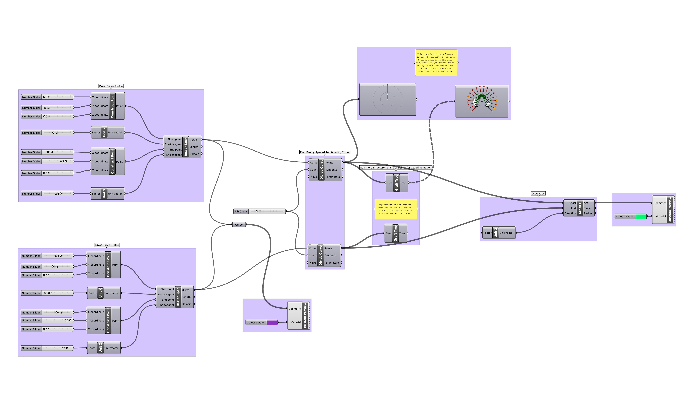
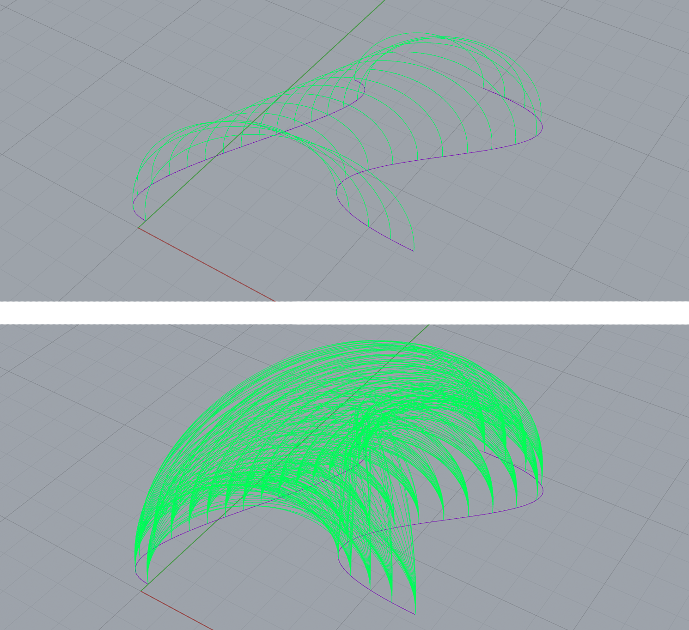
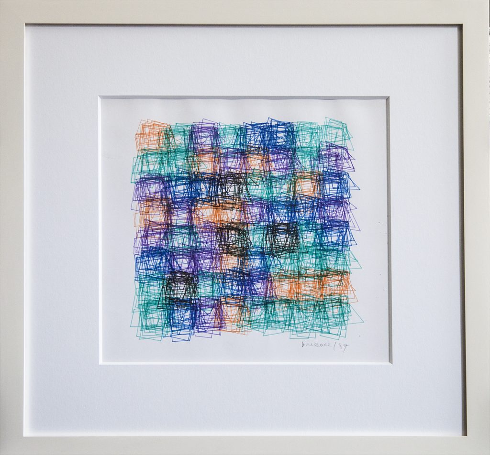
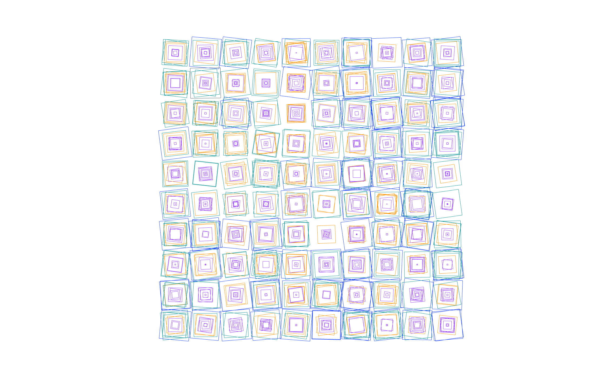
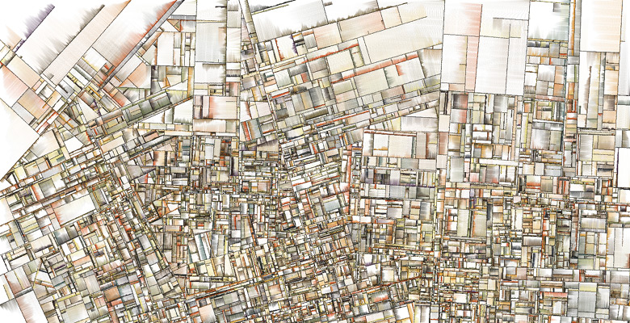
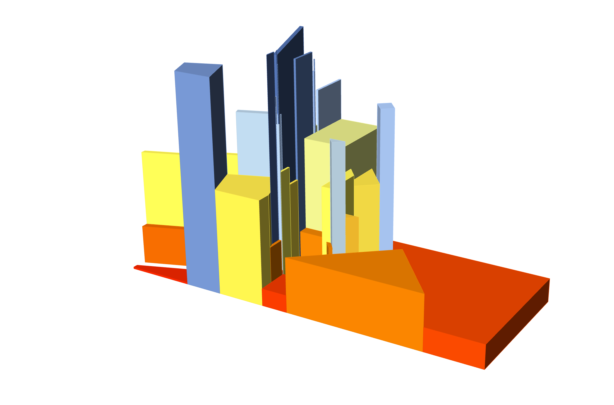

# Week 3 · Randomness and Data Flow

This week, let's discuss how randomness can aid a generative design process, and serve as the foundation for contemporary design opportunities. The focus this week will be on 2D patterns and generative art forms for *pedagogical* reasons, though the topics covered will serve frequently as both generative tools proper as well as for testing, data analysis, and aesthetic experimentation purposes.

-----

### References for the Week

Nearly all generative design works feature some degree of seeded, structured randomness. 

- [Fast Company article on Randomness in Design and Architecture](https://www.fastcompany.com/3052333/the-value-of-randomness-in-art-and-design)
- [Spotlight on Generative Artist Manolo Gamboa Naon](https://www.artnome.com/news/2018/8/8/generative-art-finds-its-prodigy)
- [Mischer Traxler](http://mischertraxler.com/projects/)
- [Simon Heijdens](http://www.simonheijdens.com/indexbig.php)
- [Snarkitechture](http://www.snarkitecture.com/drift/)
- [Interactive Generative Music Tool](https://teropa.info/loop/#/inc)
- [Another Generative Music Tool](https://sonant.generated.space)
- [Kenny Verbeeck on Randomness as Generative Design Tool](Verbeeck.pdf)
- [Kadenze Free Generative Art Certificate in 9 Hours(!?)](https://www.kadenze.com/courses/introduction-to-generative-arts-and-computational-creativity/info)
- [Glithero](http://www.glithero.com/work)
- [Maarten Baas](http://maartenbaas.com)

In non-generative design contexts, these same approaches were also especially evident in the [procedural design movement of the mid-aughts](https://www.ecal.ch/en/1181/events/exhibitions/low-tech-factory).

-----

### Randomness in Design

Computational randomness is a philosophically and technically complicated topic, with much disagreement and confusion amongst experts as well as amongst different academic disciplines.

To understand randomness for our design purposes, we need to acknowledge that randomness is *inhuman*. We have no ability to produce real randomness, and we can not even prove whether or not *any series of numbers* is random. Likewise, no computational tool we use can be truly random. In fact, were you able to [generate a method for truly random numbers](https://en.wikipedia.org/wiki/Random_number_generation), you would be one of the greatest inventors of all time — as you would have revolutionized [cryptography](https://www.design-reuse.com/articles/27050/true-randomness-in-cryptography.html), [AI and machine learning](https://ai.stackexchange.com/questions/15590/is-randomness-necessary-for-ai), and [human culture](https://en.wikipedia.org/wiki/History_of_randomness) in general. No biggie. As it stands, we have to rely on slightly [less-than-elegant approximations](https://blog.cloudflare.com/lavarand-in-production-the-nitty-gritty-technical-details/) if we want any semblance of true unpredictability in our design works.

##### Lava Lamp random number generators

Yet, though we can't generate randomness, the world exhibits *apparent* randomness everywhere. And, as designers, we often need to confront and probe that randomness as a modelable and definable input into our design research process. Users behave randomly in many situations, they are sized and placed in random combinations, they live in random locales and have unpredictable reactions to stimuli... We often, fundamental to our design discipline, are tasked with investigating this randomness and tamping its complexity down into a set of digestable patterns or categories for our clients, our partners, and ourselves. This is one of our core competencies — reducing and structuring apparent complexity.

Because generative design is fundamentally driven by the productive friction between a *controlling* algorithm and an *uncontrollable* set of inputs, fully understanding randomness is a powerful tool. At a tactical level, [random data](http://mockaroo.com) can be used to model the variability of our users and their behaviors. Similarly, random values can help test if the boundaries of an algorithm are fully considered, and will often [reveal startling combinations](https://en.wikipedia.org/wiki/Genetic_algorithm) that we might not ever otherwise consider. 

##### Randomly-evolved beetles [based](https://www.cunicode.com/works/confusing-coleopterists) on 18th century scientific illustrations

In many ways, a randomness-driven approach may seem fundamentally opposed to contemporarily-elevated *data-driven* approaches, which will be the focus for much of the rest of the course. But, the same tools and approaches that allow us to play with randomness also often permit real data once it is collected and available. So, randomness can be fundamentally generative, it can serve as a *hypothetical* placeholder, and it can also help us evaluate the expressiveness of our designed outcomes.

-----

### Types of *Aleatory* Randomness

Set-theory randomness, or the *predictability of the next element in a series*, can be [categorized](https://en.wikipedia.org/wiki/Random_number_generation) as follows. Note that the examples are simply didactic, and will not survive any real mathematical scrutiny.

- Non-Random: Every element in the series is entirely predictable
	- 1, 2, 3, 4, 5...
	- 1, 1, 2, 3, 5...
	- 2, 4, 6, 8, 10...

- [Pseudo-Randomness (Seeded Randomness)](https://en.wikipedia.org/wiki/Pseudorandom_number_generator): Given a series of inputs, an *effectively* unrelated outcome will result in the series for each input. The same input will always yield the same output, though a study of different inputs will never reveal a *consistent* relationship between different inputs and their associated outputs.
	- Seeds: 4, 1, 6, 4, 3... -> Outputs: 9.213, 3.532, 4.089, 9.213, 5.652 

- Initial Condition Randomness: A starting state is defined, and then effective randomness ensues — though outcomes are fundamentally constrained by that initial condition. Imagine a bunch of spheres rolling down a rocky mountain — the final resting point of each sphere is random, though it will be related somewhat to where the sphere started. 
	- Start: 3 -> Outputs: 2, 9, 5
	- Start: 27 -> Outputs: 72, 17, 63
	- Start: .06 -> Outputs: .09, .04, .03

- True Randomness (Environmental Randomness): There is no consistent relationship between any number in the series and any other number in the series. Neither humans nor machines can generate true randomness — though we certainly [have tried](http://www.lavarand.org)!
	- Life ([Maybe?](https://en.wikipedia.org/wiki/Determinism))

Consult this [plain language explainer](http://www.statisticsblog.com/2012/02/a-classification-scheme-for-types-of-randomness/) for more info and a slightly different classification system. An understanding of these taxonomies is especially important for generative design, as an appropriate choice of randomness will often determine how useful any implementation is to a given generative design goal.

-----

### Grasshopper Definitions

Let's get better at handling lists of data and randomness in Grasshopper by creating some generative art featuring controlled randomness and data trees. In particular, focus on how *graft* and *flatten* nodes allow us to [manipulate the structure of data trees](https://www.youtube.com/watch?v=Pkmht52TXlY), how *range* and *series* nodes generate streams of incrementing numbers, and how *remap* and *bounds* can be used to transform numbers from one domain to another. 

#### Exploring Grafting and Flattening
This example definition, which creates evenly-spaced, parallel arcs connecting two profiles somewhat similar to the [ribs of a boat hull frame](https://en.wikipedia.org/wiki/Rib_(nautical)) hopefully clarifies the principles of grafting and flattening. Play with all the sliders! 

[Download](ribbed-hull-definition.gh)

#### After Vera Molnar

Hungarian artist [Vera Molnar](http://www.veramolnar.com), one of the earliest and most prodigious generative artists, often explored distorted grids of polygons in her work. Of particular note is the series *Structure de Quadrilatéres*, which feature randomly rotated and colored rectangles arranged in a broken, square grid.

We can recreate many aspects of this work without much difficulty!

[Download](molnar-definition.gh)

#### After Jared Tarbell

American generative artist [Jared Tarbell](http://www.complexification.net/gallery/) has long been fascinated by how individual agents following simple rules can create structures of incredible visual and functional complexity. He has become especially associated with the iteratively-derived [Substrate Algorithm](http://www.complexification.net/gallery/machines/substrate/index.php), which models how a randomly moving, angularly-constrained set of agents might carve up a given space. The algorithm has been used to model crystal growth, urban sprawl, and resource allocation optimization — and also makes incredibly haunting images that evoke city and transit networks.

Check out this [interactive explainer](https://inconvergent.net/generative/fractures/) on the Substrate Algorithm for more info.

We can use the Substrate Algorithm to create models like [Sidewalk Lab's *Delve* tool](https://www.sidewalklabs.com/blog/a-first-step-toward-the-future-of-neighborhood-design/)!

[Download](substrate-definition.gh)

-----

### Homework

##### Grasshopper (4 hours)

Recreate the three examples above, paying special attention to grafting, flatterning, and random nodes, and compose any questions that bubble up in Miro. We'll spend lots of time next week in Grasshopper, so please log and plan to share any issues you encounter by marking up screenshots of the definitions in Miro.

##### Listening and Reading (1.5 hours)

Listen to a fifteen minute selection of the [*Reflection* album/song/app experience](https://open.spotify.com/track/7MMXFqR5OagEJbZLzkxTL6?si=UfAOdbHqR1-3q8lLa1MN7A) by Brian Eno. 

Then, check-out the related [Pitchfork interview](https://pitchfork.com/features/interview/10023-a-conversation-with-brian-eno-about-ambient-music/) which was produced at the release of *Reflection*. Look-up any unfamiliar names or terms and write down **3 questions, surprises, or reflections** on the episode and article for sharing next week during class discussion.

Optional: If these jams are your groove, also check out [Bloom](https://apps.apple.com/us/app/bloom/id292792586), the generative iPhone/iPad app developed by Brian Eno and his technical collaborator Peter Chilvers ($3.99). If especially interested, listen to this [recent interview podcast](https://echoes.org/2018/05/17/echoes-podcast-brian-eno-at-70/) with Eno wherein he eloquently discusses music "composing itself" and his lengthy career which intersected so many impactful musicians.
