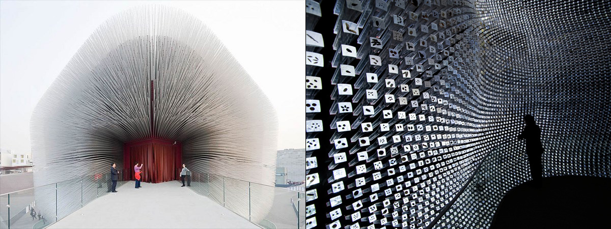
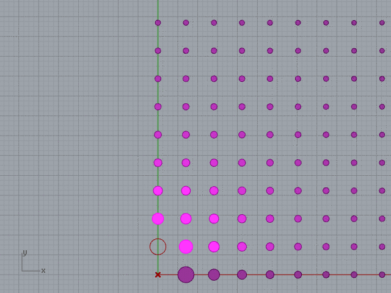
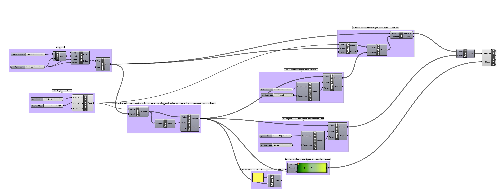
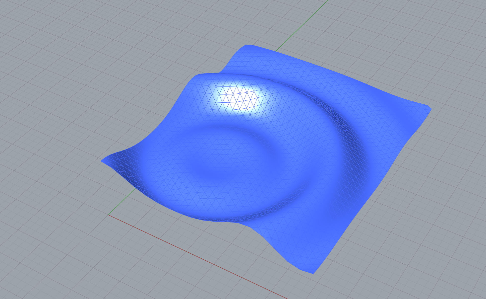

# Week 4 · Grids as Data Scaffolds

This week, we will take a look at how generative designers can use the regularity and structures of grids and other data scaffolds to seed their design work.

-----

### References for the Week

- [Christopher Alexander *A Pattern Language*](patternlanguage.pdf)
- [*Rule of Six*](http://arandalasch.com/works/rules-of-six/) by Aranda Lasch
- [Algorithmic Patterns for Façade Design](apfd.pdf) by Inês Caetano
- [Paneling methods on complex surfaces](http://www.gasathj.com/tiki-read_article.php?articleId=31) by Matteo Codignola & Vito Sirago
- [Process(ing): Generative Irregular Grid](https://medium.com/@mishaheesakkers/process-ing-generative-irregular-grid-8f0d712dfaa4) by Misha Heesakkers
- [Sand Glyphs](https://inconvergent.net/generative/sand-glyphs/) by Inconvergent (Anders Hoff)
- [Seed Cathedral](http://www.heatherwick.com/project/uk-pavilion/) by Thomas Heatherwick
- [Geometricism](http://geometricism.com) by David Wade
- [Esther Stocker](https://www.sightunseen.com/2010/02/esther-stocker-artist/)

- [Red Blob Games on Grids](http://www-cs-students.stanford.edu/~amitp/game-programming/grids/)
- [Red Blob Games on Hex Grids](https://www.redblobgames.com/grids/hexagons/)
- [Penrose Tiling](https://en.wikipedia.org/wiki/Penrose_tiling)
- [Geometric Honeycomb](https://en.wikipedia.org/wiki/Honeycomb_(geometry))
- [Beta-Skeletons](https://en.wikipedia.org/wiki/Beta_skeleton)
- [Islamic Patterns](https://patterninislamicart.com/drawings-diagrams-analyses)
- [Convex Hulls](https://en.wikipedia.org/wiki/Convex_hull)
- [Quasicrystals](https://en.wikipedia.org/wiki/Quasicrystal)

-----

### Scaffolds — Grids, Sampling, and Paneling

##### Thomas Heatherwick's [UK Pavilion/Seed Cathedral in Shanghai](http://www.heatherwick.com/project/uk-pavilion/) 

In the same way as last week's lessons asked you to draw your attention to the *range* node through a conversation about the exciting and mysterious *random* node, this week will mask the importance of the *remap* node in the excitement of regular and irregular grid scaffolds and *closest point* sets.

Many methods exist to organize a *field of points* into structured sets. Many generative design works make use of such ordering and sequencing structures to place data entitites into legible positions, sample the differential impact of simulated physical forces on an area or volume, and otherwise provide the raw materials for later manipulation and deformation. 

#### 2D (into ND) Grids

Grid structures allow for simple connections amongst a set of members *by grouping according to dimensional and axial relationships* and *proximity*. We often think of the *rows* and *columns* of grids as natively mapped to principle axes *x* and *y*, though these two-dimensional *square* grid structures can be transformed [without any data change](https://en.wikipedia.org/wiki/Graph_theory) into *radial*, *triangular*, *hexagonal*, *diamond*, or *staggered (brick)* schemata, amongst exotic others.

##### Closest Points Walker

Draw lines *from* a single movable point *to* a number of nearest grid points, to simulate a virtual 'spider' traversing the grid. Also, color nodes in grid based on distance to spider.

[Download](walker-definition.gh)

##### Distance-Based Circles

Create a grid of circles, and use the distance from a single movable point to determine the circles' radii.

[Download](circles-definition.gh)

##### Attractor/Repulsor

Distort the organization of a grid of points with a single, movable point.

[Download](attractor+repulsor-definition.gh)

##### Deformable Mesh

Use a movable point to manipulate the geometry of a 3D mesh surface.

[Download](deformable-mesh-definition.gh)

-----

### Homework

##### Grasshopper (1.5 hours)

Please recreate the *Deformable Mesh* example above. It is very similar to the *Attractor/Repulsor* variant we completed in class, and you might be able to build it already with the skills you have! Feel free to start by downloading the examples, though there will certainly be better learning outcomes if you *start from scratch* and try to build the parts that seem familiar first before adding the new methods necessary to make these examples function as animated above (vector and domain construction, respectively).

##### Listening and Watching II (1 hour)

Moving laterally a bit, but relating to our dive into generative music last week, let us investigate works in *generative literature* and *poetry*. **First**, visit [curated.ai](http://curatedai.com) and read through some of the poems hosted there. Please do not visit the "about" page until later.

Then, read through this recent New Yorker article on generative literature: [What Happens When Machines Learn To Write Poetry](https://www.newyorker.com/culture/annals-of-inquiry/the-mechanical-muse). Following that, read this short introduction to *curated.ai* at Popular Science [Artificial Intelligences Are Writing Poetry For A New Online Literary Magazine](https://www.popsci.com/ai-poetry-literary-magazine/). 

I hope we can have a robust argument about whether this is amazing, or terrible, next week. :confused: